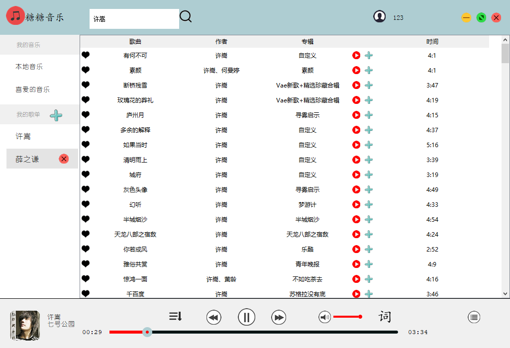
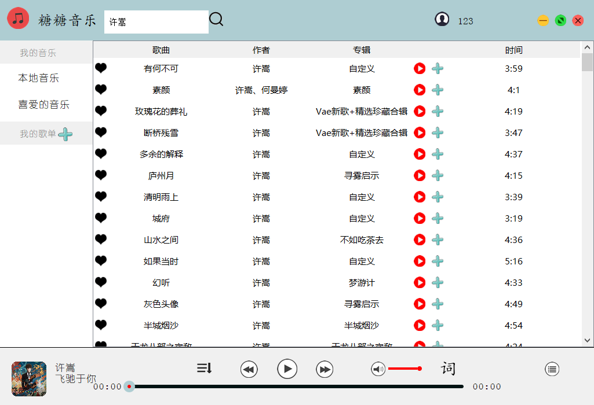

2024-5-02  
需要的同学可以去[KTVPlayer分支](https://github.com/Sugar0612/music-player/tree/KTVPlayer)使用音乐播放器，目前main分支不再维护了。
______________________________________________________________________________________________________________________________
# 糖糖音乐
# 
# 搜索界面
# 
# 歌词窗口
# 
# 使用说明:
    1. 使用本播放器需要首先注册 和 登录(在此账号创建的歌单 和 获取的音乐将永久保存)
    2. 请不要频繁操作 耐心等待3 ~ 5 秒 (害怕程序崩溃)
    3. 当获取网络音乐时 请点击播放按钮 开始播放 
# 功能介绍:
    1.支持网络搜索功能
    2.支持歌单功能 以及增添"我喜爱的音乐"
    3.支持循环播放
    4.支持所有界面的增删改操作
    5.支持歌词界面 以及歌词悬浮界面
    对源代码感兴趣的朋友 请访问我的github: 如果有什么问题欢迎和我私信
# 关于歌曲搜索功能 参考
[https://zxfdog.blog.csdn.net/article/details/107992205](https://zxfdog.blog.csdn.net/article/details/107992205)

本作品只是为了让大家更好的了解qt，熟练其中的机制，不可以用来倒卖和商用，若出现后果与本人无关。
感谢大家支持和使用
